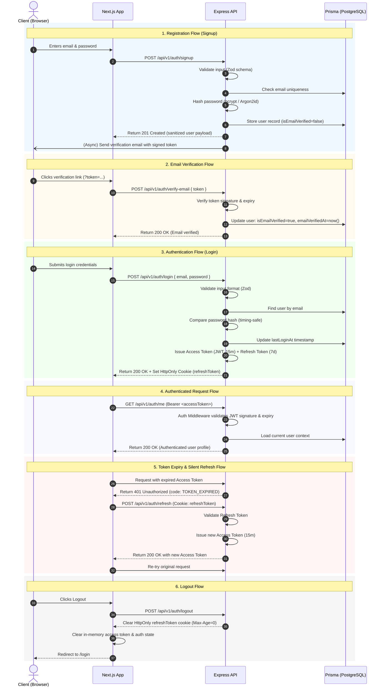

# Authentication & User System Architecture — AI Job Application Copilot

## 1. Overview & Scope

This document defines the complete architectural specification for Phase 4 (Authentication & User System) of the AI Job Application Copilot.

The system is designed to provide secure, production-grade identity management, credential authentication, session lifecycle control, and protected API authorization across the full stack:
- **Frontend**: Next.js 15 App Router (`apps/web`) running on port 3000
- **Backend**: Express.js REST API with Prisma ORM (`apps/api`) running on port 4000
- **Shared Contracts**: Type-safe shared models and API contracts (`@copilot/shared`)

### Phase 4 Task Division
1. **Task 1 (Current)**: Authentication Foundation & Design — User data model refinement, database migration, and comprehensive authentication architecture design.
2. **Task 2 (Next)**: Core Authentication Implementation — Password hashing utilities, registration (`signup`), credential validation (`login`), session invalidation (`logout`), token refresh, and request validation schemas.
3. **Task 3 (Subsequent)**: Protection & Session Integration — Authentication middleware, `/auth/me` protected endpoint, role/permission readiness, and frontend authentication flow.

---

## 2. User Data Model & Database Architecture

The identity layer is built on PostgreSQL using Prisma ORM. The `User` model acts as the authoritative authentication anchor and root entity for all user-owned domain data.

### Authoritative Prisma Schema (`apps/api/prisma/schema.prisma`)

```prisma
// =============================================================================
// USER
// Core identity record. Authentication credentials stored as a hash (never
// plaintext). Designed for email/password authentication, email verification,
// and session/token management in Phase 4.
// =============================================================================
model User {
  id              String    @id @default(cuid())
  email           String    @unique
  passwordHash    String    // Secure password hash (never plaintext)
  isEmailVerified Boolean   @default(false)
  emailVerifiedAt DateTime?
  lastLoginAt     DateTime?

  createdAt DateTime @default(now())
  updatedAt DateTime @updatedAt

  // Relations
  profile UserProfile?
  resumes Resume[]

  @@map("users")
}
```

### Field Definitions & Rationale

| Field | Type | Attributes | Description & Rationale |
| :--- | :--- | :--- | :--- |
| `id` | `String` | `@id @default(cuid())` | Unique collision-resistant identifier (CUID). Safer than sequential auto-incrementing integers against enumeration attacks, and smaller/more readable than standard UUIDv4. |
| `email` | `String` | `@unique` | Normalized user email address. Serves as the primary login credential. Prisma automatically applies a unique B-tree index (`users_email_key`) enabling fast O(1)/O(log N) lookups. |
| `passwordHash` | `String` | Non-nullable | Cryptographic hash of the user password (via bcrypt or Argon2id). Non-nullable constraint guarantees no account can exist in the database without a valid credential hash. Never exposed via API. |
| `isEmailVerified` | `Boolean` | `@default(false)` | Boolean flag indicating whether the user has verified ownership of their email address. Defaults to unverified on signup. |
| `emailVerifiedAt` | `DateTime?` | Nullable | Exact UTC timestamp when the user completed email verification. Null for unverified accounts. |
| `lastLoginAt` | `DateTime?` | Nullable | UTC timestamp recorded on each successful credential verification. Provides auditability, dormant account detection, and session security tracking. |
| `createdAt` | `DateTime` | `@default(now())` | Immutable account creation timestamp. |
| `updatedAt` | `DateTime` | `@updatedAt` | Auto-updating timestamp modified whenever user record is altered. |

### Relations & Domain Integrity
- **`profile UserProfile?`**: 1-to-1 extension storing biographical and professional details (headline, location, links). Maintained with foreign key `userId` and `onDelete: Cascade`.
- **`resumes Resume[]`**: 1-to-many relation containing user uploaded resumes and structured analysis data. Maintained with foreign key `userId` and `onDelete: Cascade`.
- **Relational Invariants**: Cascading deletes ensure that account removal cleanly purges associated profiles, resumes, and future applications without leaving orphaned records.

### Migration Status
- Migration `20261003083304_add_auth_user_fields` created and successfully applied to the PostgreSQL database.
- Prisma Client (`v7.10.0`) regenerated with full type safety for all new fields (`isEmailVerified`, `emailVerifiedAt`, `lastLoginAt`, and required `passwordHash`).

---

## 3. Planned Authentication Lifecycle

The following high-level sequence governs identity management, credential exchange, session maintenance, and resource protection:



### Component Responsibilities Breakdown

| Stage | Responsibility |
| :--- | :--- |
| **Signup** | Validates email syntax, trims/lowercases inputs, enforces minimum password entropy (length, character classes). Checks for existing email conflicts without leaking sensitive error messages. Generates user entity and initiates verification workflow. |
| **Password Hashing** | Uses strong, slow, cryptographic hashing algorithms (bcrypt with cost factor $\ge 12$, or Argon2id). Never executes on plaintext storage. Hashing occurs strictly in isolated service layer before persistence. |
| **Login** | Performs constant-time password comparison to prevent timing attacks. On failure, responds with generic error messages ("Invalid email or password") to eliminate account enumeration vectors. Updates `lastLoginAt`. |
| **Session / Token Issuance** | Generates dual-token pair: short-lived Access Token containing claims (`sub`, `email`, `iat`, `exp`) and long-lived Refresh Token stored in an `HttpOnly`, `Secure` browser cookie. |
| **Authentication Middleware** | Intercepts requests on protected endpoints. Extracts access token from `Authorization: Bearer <token>` (or fallback secure cookie). Verifies cryptographic signature and expiration. Attaches typed `req.user` payload to Express request context. |
| **Protected Routes** | Endpoints that require authenticated identity (e.g. `/api/v1/auth/me`, `/api/v1/resumes`, `/api/v1/applications`). Automatically inherit validated user context from middleware. |
| **Email Verification** | Issues cryptographically signed, tamper-evident verification tokens with finite lifetimes (e.g. 24 hours). Sets `isEmailVerified = true` and records `emailVerifiedAt` upon valid token submission. |
| **Logout** | Instructs client browser to immediately invalidate and expire the `refreshToken` and session cookies via `Set-Cookie: ... Max-Age=0`. Client purges cached access token from memory. |

---

## 4. Authentication Architecture Decision

### Evaluation of Strategies for Next.js + Express

| Strategy | Advantages | Vulnerabilities / Drawbacks | Verdict |
| :--- | :--- | :--- | :--- |
| **A. Pure Server-Side Sessions (Redis / DB)** | Immediate session revocation; stateful control. | Requires extra infrastructure (Redis) or frequent DB queries per request; less scalable across microservices. | Overkill for initial phases; requires external session store. |
| **B. JWT in LocalStorage** | Easy to implement; works across origins out-of-the-box. | **Severe security risk**: Highly vulnerable to XSS token exfiltration; tokens cannot be protected from malicious scripts. | **REJECTED**: Insecure for production authentication. |
| **C. Single Long-lived JWT Cookie** | Simple; zero DB state. | If leaked or compromised, cannot be revoked until expiration; long-lived tokens increase risk window. | Rejected due to lack of revocation agility. |
| **D. Hybrid Dual-Token Strategy (Selected)** | High security: Access token is short-lived; refresh token is locked in an `HttpOnly`, `Secure` cookie protected from XSS. Fast stateless API validation. | Requires silent token refresh handling on frontend. | **RECOMMENDED & SELECTED**: Modern production standard for decoupled SPAs and REST APIs. |

### Selected Architecture: Dual-Token Cookie Strategy

#### 1. Access Token (Stateless JWT)
- **Format**: Signed JSON Web Token (`HS256` or `RS256`).
- **Lifetime**: 15 minutes (`15m`).
- **Payload**:
  ```json
  {
    "sub": "cuid_user_id",
    "email": "user@example.com",
    "iat": 1740000000,
    "exp": 1740000900
  }
  ```
- **Storage**: Kept in-memory in the Next.js client application state (e.g. React context / memory).
- **Transport**: Transmitted in the standard HTTP request header:
  `Authorization: Bearer <access_token>`
- **Validation**: Stateless verification by `auth.middleware.ts` using `jwt.verify(token, JWT_ACCESS_SECRET)`. No database queries needed for high-frequency API traffic.

#### 2. Refresh Token (Secure HttpOnly Cookie)
- **Format**: Cryptographically signed refresh JWT or secure random token.
- **Lifetime**: 7 days (`7d`).
- **Payload**:
  ```json
  {
    "sub": "cuid_user_id",
    "tokenType": "refresh",
    "iat": 1740000000,
    "exp": 1740604800
  }
  ```
- **Storage**: Browser cookie stored by the browser runtime, inaccessible to JavaScript.
- **Cookie Configuration**:
  ```ts
  const refreshCookieOptions: CookieOptions = {
    httpOnly: true,                                       // Prevents XSS script access
    secure: env.isProduction,                             // Requires HTTPS in production
    sameSite: env.isProduction ? 'strict' : 'lax',        // Mitigates CSRF
    path: '/api/v1/auth',                                 // Scoped strictly to auth routes
    maxAge: 7 * 24 * 60 * 60 * 1000,                      // 7 days in milliseconds
  };
  ```

#### 3. Cross-Origin Resource Sharing (CORS) Integration
- `apps/api/src/app.ts` already configures `cors({ credentials: true })`.
- Frontend fetch calls must include `credentials: 'include'` (or `withCredentials: true` with Axios) so the browser automatically sends the `refreshToken` cookie during `/api/v1/auth/refresh` and `/api/v1/auth/logout`.

#### 4. Handling Expired Authentication (Silent Refresh)
1. Frontend makes API call with current Access Token.
2. If token is expired, backend responds with `401 Unauthorized` and structured code:
   ```json
   {
     "success": false,
     "error": {
       "code": "TOKEN_EXPIRED",
       "message": "Access token has expired"
     }
   }
   ```
3. Frontend API client interceptor intercepts `TOKEN_EXPIRED`.
4. Interceptor queues pending requests and calls `POST /api/v1/auth/refresh`.
5. Backend verifies the `refreshToken` cookie. If valid, issues a new Access Token in the response body.
6. Frontend updates in-memory token and retries all queued requests seamlessly.
7. If refresh token is expired, invalid, or missing, backend returns `401 Unauthorized` (`REFRESH_TOKEN_INVALID`), and the frontend redirects the user to `/login`.

---

## 5. Planned Authentication API Routes (`/api/v1/auth/*`)

All authentication endpoints adhere to the existing API versioning pattern (`/api/v1/*`) and return standardized response envelopes.

### 1. `POST /api/v1/auth/signup`
- **Purpose**: Register a new user account.
- **Authentication**: None (Public).
- **Request Body**:
  ```json
  {
    "email": "user@example.com",
    "password": "StrongPassword123!"
  }
  ```
- **Validation Rules**:
  - `email`: Valid RFC 5322 format, lowercased, trimmed.
  - `password`: Minimum 8 characters, maximum 128 characters; requires at least one uppercase letter, one lowercase letter, and one number.
- **Expected Success Response** (`201 Created`):
  ```json
  {
    "success": true,
    "message": "Account created successfully. Please check your email to verify your account.",
    "data": {
      "user": {
        "id": "cuid_example",
        "email": "user@example.com",
        "isEmailVerified": false,
        "createdAt": "2026-10-03T08:33:04.000Z"
      }
    }
  }
  ```
- **Error Scenarios**:
  - `400 Bad Request`: Input validation failed (invalid email format, password too weak).
  - `409 Conflict`: Email already registered (`EMAIL_ALREADY_EXISTS`).
  - `429 Too Many Requests`: Rate limit exceeded on registration endpoint.

---

### 2. `POST /api/v1/auth/login`
- **Purpose**: Authenticate user via email and password, establishing an authenticated session.
- **Authentication**: None (Public).
- **Request Body**:
  ```json
  {
    "email": "user@example.com",
    "password": "StrongPassword123!"
  }
  ```
- **Headers / Cookies Set**:
  - `Set-Cookie`: `refreshToken=<jwt>; HttpOnly; Secure; SameSite=Lax; Path=/api/v1/auth; Max-Age=604800`
- **Expected Success Response** (`200 OK`):
  ```json
  {
    "success": true,
    "message": "Login successful",
    "data": {
      "accessToken": "eyJhbGciOi...",
      "user": {
        "id": "cuid_example",
        "email": "user@example.com",
        "isEmailVerified": true,
        "lastLoginAt": "2026-10-03T08:35:00.000Z"
      }
    }
  }
  ```
- **Error Scenarios**:
  - `400 Bad Request`: Missing or malformed email/password fields.
  - `401 Unauthorized`: Invalid credentials (`INVALID_CREDENTIALS` — generic message used to avoid account enumeration).
  - `429 Too Many Requests`: Rate limit exceeded (brute-force defense).

---

### 3. `POST /api/v1/auth/refresh`
- **Purpose**: Exchange a valid refresh token cookie for a fresh short-lived access token.
- **Authentication**: Requires valid `refreshToken` cookie.
- **Request**: Sent with `credentials: 'include'` containing the `refreshToken` cookie. Body is empty.
- **Expected Success Response** (`200 OK`):
  ```json
  {
    "success": true,
    "message": "Token refreshed successfully",
    "data": {
      "accessToken": "eyJhbGciOi..."
    }
  }
  ```
- **Error Scenarios**:
  - `401 Unauthorized`: Missing refresh token cookie (`REFRESH_TOKEN_MISSING`), expired refresh token (`REFRESH_TOKEN_EXPIRED`), or invalid signature (`REFRESH_TOKEN_INVALID`).

---

### 4. `POST /api/v1/auth/logout`
- **Purpose**: Invalidate client session and clear authentication cookies.
- **Authentication**: Optional / None (idempotent; can be called regardless of token validity).
- **Request**: Empty body with credentials.
- **Headers / Cookies Set**:
  - `Set-Cookie`: `refreshToken=; HttpOnly; Secure; SameSite=Lax; Path=/api/v1/auth; Max-Age=0`
- **Expected Success Response** (`200 OK`):
  ```json
  {
    "success": true,
    "message": "Logged out successfully"
  }
  ```
- **Error Scenarios**:
  - Idempotent: Returns 200 even if no active session was present.

---

### 5. `GET /api/v1/auth/me`
- **Purpose**: Fetch identity details, verification status, and profile information for the authenticated user.
- **Authentication**: Required (`Authorization: Bearer <accessToken>`).
- **Request Headers**:
  - `Authorization`: `Bearer <accessToken>`
- **Expected Success Response** (`200 OK`):
  ```json
  {
    "success": true,
    "data": {
      "user": {
        "id": "cuid_example",
        "email": "user@example.com",
        "isEmailVerified": true,
        "emailVerifiedAt": "2026-10-03T08:34:00.000Z",
        "lastLoginAt": "2026-10-03T08:35:00.000Z",
        "createdAt": "2026-10-03T08:33:04.000Z",
        "profile": {
          "id": "cuid_profile",
          "firstName": "Alex",
          "lastName": "Developer",
          "headline": "Full Stack Engineer"
        }
      }
    }
  }
  ```
- **Error Scenarios**:
  - `401 Unauthorized`: Missing token, invalid token signature, or expired access token (`TOKEN_EXPIRED`).
  - `404 Not Found`: User record no longer exists in database (`USER_NOT_FOUND`).

---

### 6. `POST /api/v1/auth/verify-email`
- **Purpose**: Verify a user's email address using a verification token sent via email.
- **Authentication**: None (Token validated from payload).
- **Request Body**:
  ```json
  {
    "token": "eyJhbGciOi..."
  }
  ```
- **Expected Success Response** (`200 OK`):
  ```json
  {
    "success": true,
    "message": "Email address verified successfully",
    "data": {
      "isEmailVerified": true,
      "emailVerifiedAt": "2026-10-03T08:34:00.000Z"
    }
  }
  ```
- **Error Scenarios**:
  - `400 Bad Request`: Token format missing or malformed.
  - `401 Unauthorized`: Verification token expired or invalid signature.
  - `404 Not Found`: Associated user account does not exist.

---

### 7. `POST /api/v1/auth/resend-verification`
- **Purpose**: Re-issue and dispatch a new email verification token to the user.
- **Authentication**: Public or Authenticated.
- **Request Body**:
  ```json
  {
    "email": "user@example.com"
  }
  ```
- **Expected Success Response** (`200 OK`):
  ```json
  {
    "success": true,
    "message": "If an unverified account exists with that email, a verification link has been sent."
  }
  ```
- **Error Scenarios**:
  - `429 Too Many Requests`: Strictly rate-limited (e.g. maximum 3 requests per hour per IP/email) to prevent email flooding.

---

## 6. Backend Project Structure & Placement

The implementation in Tasks 2 and 3 will follow the established modular architecture of `apps/api`:

```
apps/api/src/
├── config/
│   ├── env.ts                  # Typed environment configuration (add JWT secrets)
│   └── logger.ts               # Structured Pino logger
├── controllers/
│   ├── auth.controller.ts      # HTTP request handling, cookie setting, status codes (Task 2)
│   ├── health.controller.ts    # Liveness check
│   └── health-db.controller.ts # Database readiness check
├── db/
│   ├── prisma.ts               # Singleton Prisma Client
│   └── index.ts                # Database module export
├── middleware/
│   ├── auth.middleware.ts      # JWT extraction, verification, req.user injection (Task 3)
│   ├── errorHandler.ts         # Global error handler
│   ├── notFound.ts             # 404 handler
│   ├── requestLogger.ts        # Pino HTTP request logging
│   └── validate.ts             # Zod validation middleware wrapper
├── routes/
│   ├── index.ts                # Root API router
│   └── v1/
│       ├── index.ts            # v1 router mounting /auth (Task 2)
│       ├── auth.routes.ts      # Endpoint route definitions & schema binding (Task 2)
│       └── health.routes.ts    # Health routes
├── schemas/
│   └── auth.schema.ts          # Zod validation schemas for signup, login, verify (Task 2)
├── services/
│   └── auth.service.ts         # Authentication business logic & database queries (Task 2)
└── utils/
    ├── asyncHandler.ts         # Async wrapper for Express handlers
    ├── errors.ts               # AppError, UnauthorizedError, ConflictError classes
    ├── password.ts             # Password hashing and constant-time verification (Task 2)
    └── token.ts                # JWT access/refresh token generation and verification (Task 2)
```

---

## 7. Security Architecture & Implementation Requirements

### 1. Password Security
- **No Plaintext Passwords**: Plaintext passwords must never be stored, logged, or cached at any point in the lifecycle.
- **Hash Algorithm**: Bcrypt with work factor $\ge 12$ (or Argon2id).
- **Entropy & Validation**: Enforced via Zod schema (`min(8)`, `max(128)`, requiring mixed casing and digits).

### 2. Secret Hygiene
- `JWT_ACCESS_SECRET` and `JWT_REFRESH_SECRET` must be separate, high-entropy secrets ($\ge 256$ bits / 32+ characters).
- Environment variables must be declared in `.env.example` and validated on application boot via `config/env.ts`.

### 3. Information Leakage Prevention
- **Generic Login Failures**: Always return generic message `"Invalid email or password"` on credential failure. Never indicate whether the email or the password was the incorrect component.
- **Exclusion of Password Hashes**: Prisma queries in auth controllers and services must use field selection or omit utilities to guarantee `passwordHash` is never serialized into API responses.

### 4. Cookie Protection & CSRF Defense
- `HttpOnly`: Set to `true` to block client JavaScript (`document.cookie`) access and neutralize token exfiltration via XSS.
- `Secure`: Enabled in production environments (`secure: env.isProduction`) to ensure cookies are only transmitted over TLS/HTTPS.
- `SameSite`: Configured to `Lax` (or `Strict`), preventing automated cross-site submission by third-party origins.
- `Path`: Scoped to `/api/v1/auth` to prevent leaking the refresh cookie to non-auth API endpoints or static assets.

### 5. Logging Standards
- Structured Pino logging will record authentication events:
  - ✅ `user_signup_success`, `login_success`, `token_refreshed`, `logout_success`
  - ⚠️ `login_failed`, `token_verification_failed`
- **Data Redaction**: Loggers must never capture passwords, token values, cookie headers, or authorization headers.

### 6. Rate Limiting Plan (To be implemented in Task 2/3)
- Rate limiting middleware (`express-rate-limit`) will be assigned to sensitive auth routes:
  - `POST /api/v1/auth/login`: Maximum 5 failed attempts per 15 minutes per IP.
  - `POST /api/v1/auth/signup`: Maximum 10 registrations per hour per IP.
  - `POST /api/v1/auth/resend-verification`: Maximum 3 requests per hour per email.

---

## 8. Verification & Next Steps

### Completed in Task 1:
- [x] Prisma schema inspected and updated with production-ready `User` model fields (`isEmailVerified`, `emailVerifiedAt`, `lastLoginAt`, and non-nullable `passwordHash`).
- [x] Schema validated with `prisma validate`.
- [x] Migration `20261003083304_add_auth_user_fields` generated and applied to PostgreSQL database.
- [x] Prisma Client regenerated with updated typings.
- [x] Verified existing relations (`UserProfile`, `Resume`) remain intact with cascading constraints.
- [x] Full TypeScript type-check and lint checks verified clean across all workspaces.
- [x] Complete authentication architecture and flow documented in `docs/authentication.md`.

### Carry-over Decisions for Task 2:
1. Implement password hashing in `apps/api/src/utils/password.ts` using bcrypt.
2. Implement JWT token utilities in `apps/api/src/utils/token.ts` with access token and refresh token separation.
3. Add `JWT_ACCESS_SECRET` and `JWT_REFRESH_SECRET` configuration to `apps/api/src/config/env.ts` and `.env.example`.
4. Create Zod request validation schemas in `apps/api/src/schemas/auth.schema.ts`.
5. Create `auth.service.ts` handling user lookup, password comparison, token generation, and user creation.
6. Create `auth.controller.ts` and `auth.routes.ts` mounted under `/api/v1/auth`.
